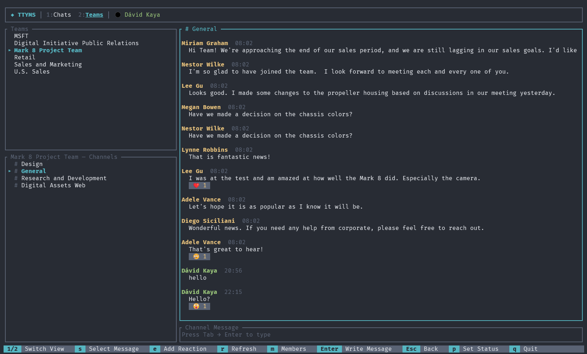

# ttyms — Terminal Microsoft Teams Client

A secure, fast terminal UI client for Microsoft Teams messaging, built in Rust with [ratatui](https://ratatui.rs/).

 

> **⚠️ Here be dragons!** ttyms is in alpha — part experiment, part playground, part "what if Teams lived in a terminal?" fever dream. Things may break, features may vanish, and your terminal might judge your meeting schedule. Use at your own risk (and enjoyment). 🐉

> **📋 Legal fine print:** This is a personal side project with zero affiliation to Microsoft. No Microsoft engineers were harmed in the making of this tool. All trademarks belong to their respective owners — I just really like terminals. ⚖️

## Features

- **1:1 and group chat messaging** — browse all your Teams chats, read messages, and reply
- **Teams & Channels** — browse joined teams, navigate channels, read and post channel messages
- **Channel member list** — toggle member sidebar with `m` to see who's in the channel (owners marked with 👑)
- **Reply to messages** — quote-reply to any message with `r` key
- **Edit & delete messages** — edit your own messages with `w`, delete with `d`
- **Message pagination** — scroll up to load older messages automatically
- **Reactions** — view message reactions (👍❤️😂😮😢😡) and react with keyboard shortcut
- **Presence** — see online status of contacts, set your own presence (Available, Busy, DND, Away)
- **Unread indicators** — unread message counts per chat, total unread badge in header
- **Rich text rendering** — bold, italic, code, and links rendered with terminal formatting
- **Beautiful TUI** — clean terminal interface with tabbed views, panels, color-coded messages
- **Command palette** — `Ctrl+P` fuzzy-find across chats, channels, and actions
- **Message search** — full-text search across all chats via `/` key
- **Chat management** — rename group chats, add/remove members, leave chats
- **File sharing** — upload and share files (up to 4 MB) in chats and channels via `f` key
- **Image previews** — image attachments show inline decoded terminal previews (grayscale block rendering) with Enter-to-open
- **Settings dialog** — configurable refresh interval via in-app settings
- **Delta-based sync** — incremental message updates for efficient polling
- **Troubleshooting logs** — writes non-PII lifecycle/error events to a standard per-user log file
- **Secure by design** — tokens stored in OS credential manager, sensitive data zeroized in memory
- **Auto-refresh** — messages update automatically every 15 seconds with terminal bell for new messages
- **Vim-style navigation** — use `j`/`k` or arrow keys to navigate
- **Mouse support** — click to select chats/teams/channels, scroll messages, focus panels

## Screenshots



## Prerequisites

- **Microsoft 365 account** with Teams access (work or school account required — personal Microsoft accounts are not supported by the Teams Graph API)

## Installation

### Homebrew (macOS / Linux)

```sh
brew install davidkaya/tap/ttyms
```

### Cargo (all platforms)

```sh
cargo install ttyms
```

### Arch Linux (AUR)

```sh
# Using an AUR helper (e.g., yay, paru)
yay -S ttyms      # stable release from crates.io
yay -S ttyms-git  # latest from git
```

### From source

```sh
git clone https://github.com/davidkaya/ttyms.git
cd ttyms
cargo build --release
# Binary at target/release/ttyms
```

## Setup

ttyms ships with a default Azure AD client ID, so it works out of the box — no app registration required.

Just run it:

```sh
ttyms
```

On first run, you'll be prompted to sign in using the device code flow.

### Configuration (optional)

A config file is created on first run at:
- **Windows**: `%APPDATA%\ttyms\config.toml`
- **macOS**: `~/Library/Application Support/ttyms/config.toml`
- **Linux**: `~/.config/ttyms/config.toml`

You can override the default client ID with your own Azure AD app registration:

```toml
client_id = "your-application-client-id-here"
tenant_id = "common"
```

<details>
<summary><strong>Registering your own Azure AD Application</strong></summary>

1. Go to [Azure Portal](https://portal.azure.com) → **Microsoft Entra ID** → **App registrations**
2. Click **New registration**
3. Set:
   - **Name**: `ttyms` (or any name)
   - **Supported account types**: *Accounts in any organizational directory* (multi-tenant; personal Microsoft accounts are not supported by Teams Graph API)
   - **Redirect URI**: leave blank
4. Click **Register**
5. Go to **Authentication**:
   - Enable **Allow public client flows** → Save
   - Click **Add a platform** → **Mobile and desktop applications**
   - Under custom redirect URIs, add: `http://localhost` → Save
6. Go to **API permissions** → **Add a permission** → **Microsoft Graph** → **Delegated permissions**:
   - `User.Read`
   - `User.ReadBasic.All`
   - `Chat.ReadWrite`
   - `ChatMessage.Read`
   - `ChatMessage.Send`
   - `Presence.Read`
   - `Presence.ReadWrite`
   - `Team.ReadBasic.All`
   - `Channel.ReadBasic.All`
   - `ChannelMessage.Read.All`
   - `ChannelMessage.Send`
   - `offline_access`
7. Copy the **Application (client) ID** and set it in your `config.toml`

</details>

### Authentication Options

**Device Code Flow (default)** — displays a code, you sign in via browser:
```sh
cargo run
```

**PKCE Browser Flow** — browser opens automatically, redirects to localhost:
```sh
cargo run -- --pkce
```

## Usage

### Views

| Key | View |
|-----|------|
| `1` | Chats — 1:1 and group chat messaging |
| `2` | Teams — browse teams and channel conversations |

### Keyboard Shortcuts (Chats)

| Key | Action |
|---|---|
| `Tab` / `Shift+Tab` | Switch between panels (Chats → Messages → Input) |
| `↑`/`↓` or `j`/`k` | Navigate chats / scroll messages / select messages |
| `Enter` | Send message / jump to input / open selected attachment preview |
| `n` | New chat |
| `s` | Toggle message selection (in Messages panel) |
| `r` | Reply to selected message / Refresh (when no selection) |
| `e` | React to selected message |
| `w` | Edit selected message (own messages only) |
| `d` | Delete selected message (own messages only) |
| `p` | Set your presence status |
| `/` | Search messages |
| `f` | Share file (upload and send attachment) |
| `g` | Manage chat (members, rename) |
| `o` | Settings |
| `Ctrl+P` | Command palette — fuzzy-find chats, channels, actions |
| `Esc` | Back / deselect / cancel reply or edit |
| `q` | Quit |
| `Ctrl+C` | Force quit |

### Keyboard Shortcuts (Teams)

| Key | Action |
|---|---|
| `Tab` / `Shift+Tab` | Switch panels (Teams → Channels → Messages → Input) |
| `↑`/`↓` or `j`/`k` | Navigate teams / channels / scroll messages |
| `Enter` | Expand team / select channel / send message / open selected attachment preview |
| `s` | Toggle message selection (in Channel Messages panel) |
| `r` | Reply to selected message / Refresh (when no selection) |
| `e` | React to selected message |
| `w` | Edit selected message (own messages only) |
| `d` | Delete selected message (own messages only) |
| `m` | Toggle channel member list |
| `f` | Share file (upload and send attachment) |
| `Esc` | Go back one panel / deselect / cancel reply or edit |

### Mouse Support

| Action | Effect |
|---|---|
| Left click on panel | Focus that panel |
| Left click on chat/team/channel | Select the clicked item |
| Scroll wheel | Scroll messages or navigate lists |

### Global Shortcuts

| Key | Action |
|---|---|
| `Ctrl+P` | Command palette — fuzzy-find chats, channels, actions |
| `/` | Search messages |
| `p` | Set your presence status |
| `o` | Settings |
| `1` / `2` | Switch between Chats and Teams views |

### Reaction Picker

When a message is selected (`s` key), press `e` to open the reaction picker:
- `←`/`→` to choose emoji: 👍 ❤️ 😂 😮 😢 😡
- `Enter` to react
- `Esc` to cancel

### Presence Picker

Press `p` to set your status:
- `↑`/`↓` to select: 🟢 Available, 🔴 Busy, ⛔ DND, 🟡 Away, ⚫ Offline
- `Enter` to set
- `Esc` to cancel

### CLI Options

```sh
ttyms --help              # Show help
ttyms --pkce              # Use PKCE browser flow instead of device code
ttyms --logout            # Clear stored credentials securely
ttyms --client-id <ID>    # Override client_id from config
```

## Troubleshooting Logs

ttyms writes troubleshooting logs to a per-user file and only logs predefined event labels (no message text, user identifiers, tokens, URLs, or other PII). Coverage includes startup/auth, Graph request outcomes, async refresh/presence flows, file sharing, and image preview queue/download/decode stages.

- **Windows**: `%LOCALAPPDATA%\ttyms\logs\ttyms.log`
- **macOS**: `~/Library/Logs/ttyms/ttyms.log`
- **Linux**: `$XDG_STATE_HOME/ttyms/logs/ttyms.log` (fallback: `~/.local/state/ttyms/logs/ttyms.log`)

## Security

| Concern | Mitigation |
|---|---|
| Token storage | OS credential manager via [`keyring`](https://crates.io/crates/keyring) crate |
| Memory safety | Tokens zeroized on drop via [`zeroize`](https://crates.io/crates/zeroize) crate |
| Auth flow | OAuth2 Device Code Flow (public client, no client secret stored) |
| Transport | All API calls over HTTPS to Microsoft Graph |
| Scopes | Minimal permissions per feature, all delegated (user context only) |
| Logout | `--logout` securely removes credentials from OS store |
| Read receipts | Chats automatically marked as read when viewed |

## Building

```sh
# Debug build
cargo build

# Release build (optimized)
cargo build --release
```

## License

MIT
